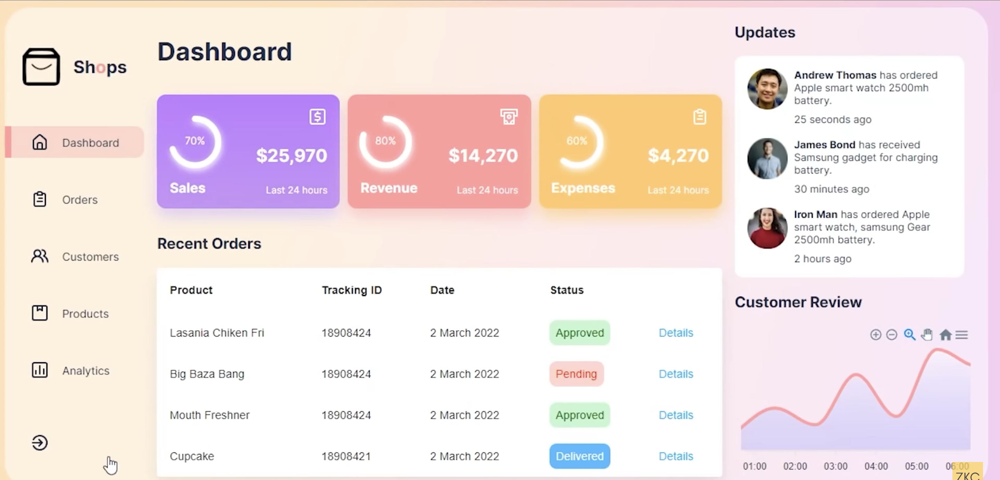

# Admin Panel Tutorial

**Reference URL**: [Project Tutorial](https://youtu.be/K7vHoUwClaM?si=dVlJbULvtF7cPXV0 "Go watch the tutorial")

## Project Image

## Project Description

Learn how to make beautiful and responsive admin dashboard in Reactjs. We will use React hooks, apexcharts, motion-framer, modern css and many more from scratch during the development of this admin panel.

- JS Map method
- <code>UseState</code> Hook
- Apex Charts
- Framer Motion
- Modern CSS
- Icon Scout
- Material UI (MUI)
- Emotion (css-in-js)
- Google Fonts
- <u>Tools</u>: Vite, TypeScript

## How to run

1. npm install
2. npm run dev
